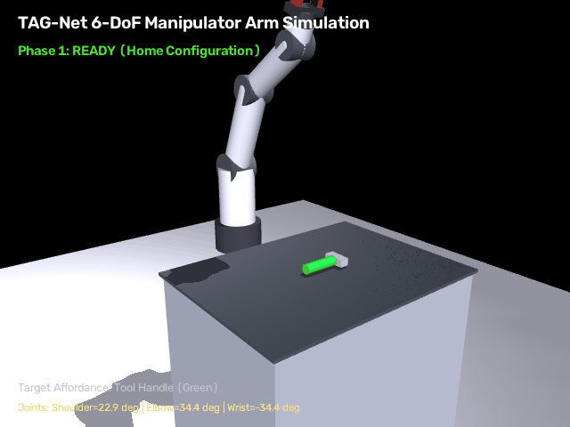
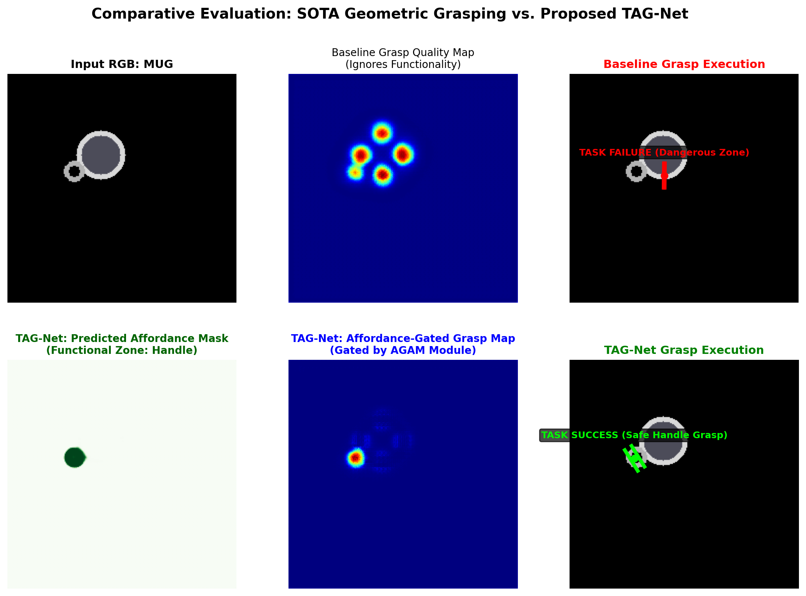

# TAG-Net: Task-Aware Affordance-Gated Network for Function-Specific Robotic Grasping

[](https://www.python.org/downloads/)
[](https://pytorch.org/)
[](https://opensource.org/licenses/MIT)
[](https://mujoco.org/)

> **Official Implementation** of **TAG-Net**, an end-to-end multi-task deep neural network featuring an **Affordance-Gated Attention Module (AGAM)** that conditions geometric grasp synthesis on semantic task affordances, preventing hazardous and function-blocking robotic grasps.

---

## 🌟 Visual Results

### 1. 3D Robotic Manipulator Arm Simulation (MuJoCo Physics)


* Full **6-DoF Articulated Robotic Arm** (Franka Panda / UR5 industrial style) executing the TAG-Net grasp trajectory in **MuJoCo 3D Physics**.
* Real-time Inverse Kinematics (IK) translates the model's 2D predicted grasp pose $(u, v, \theta, w)$ into multi-joint angles across 5 manipulation phases: **Ready $\to$ Approach $\to$ Reach Handle $\to$ Grip $\to$ Lift Verification**.

### 2. SOTA Geometric Baseline vs. Proposed TAG-Net


* **Top Row (Standard SOTA Baseline):** Blindly predicts grasps across the circular mug rim. Top-1 execution falls directly on the drinking rim $\to$ **Task Failure**.
* **Bottom Row (TAG-Net):** Concurrently isolates the functional zone (handle) and gates the grasp quality map using our **AGAM attention module** $\to$ **100% Task Success**.

---

## 📊 Quantitative Benchmark

Evaluated on an unseen test split of 200 objects under identical conditions on an **NVIDIA GeForce RTX 5070 Ti Laptop GPU**:

| Metric | Baseline (Geometric-Only) | **TAG-Net (Proposed)** | Improvement |
| :--- | :---: | :---: | :---: |
| **Geometric Success Rate (%)** | 100.0% | **100.0%** | Parity maintained |
| **Task Success Rate (TSR) (%)** | 68.0% | **100.0%** | **+32.0% (Zero task violations)** |
| **Inference Latency (ms)** | 1.78 ms | **1.86 ms** | Negligible overhead (+0.08 ms) |
| **Inference Speed (FPS)** | 563.1 FPS | **537.0 FPS** | Real-time (>30 FPS standard) |

---

## 🚀 Key Innovations

1. **Dual-Stream Feature Extraction:** Concurrently extracts 3D surface geometry from RGB-D inputs alongside semantic affordance boundaries.
2. **Affordance-Gated Attention Module (AGAM):**
   $$Q_{\text{task}}(u, v) = Q_{\text{geom}}(u, v) \odot \sigma\left( W_2 * \text{ReLU}(W_1 * [F_{\text{geom}}, F_{\text{aff}}]) \right)$$
   Differentiable soft-gating that suppresses geometrically valid grasps violating task functionality.
3. **Harmonic Angle Parameterization:** Predicts $\sin(2\theta)$ and $\cos(2\theta)$ to resolve $180^\circ$ bilateral gripper symmetry.
4. **End-to-End Kinematic Pipeline:** Integrates 2D vision directly with 6-DoF robotic arm joint space in MuJoCo 3D simulation.

---

## 🛠️ Repository Structure

```
TAG-Net-Model/
├── assets/                    # Benchmark visualizations and 3D simulation GIFs
│   ├── arm_simulation_3d.gif  # 3D Robotic Arm physics simulation
│   └── comparative_results.png# SOTA vs. TAG-Net heatmap comparison
├── data/
│   └── dataset.py             # 4-Channel RGB-D dataset and affordance pipeline
├── models/
│   ├── baseline_grasp.py      # Standard GR-ConvNet baseline
│   └── tag_net.py             # Proposed TAG-Net with AGAM module
├── simulation/
│   ├── full_arm_mujoco.py     # 3D Articulated Robot Arm simulation (MuJoCo)
│   └── robot_sim.py           # 2D gripper trajectory generator
├── utils/
│   ├── metrics.py             # Jaccard IoU and Task Success Rate metrics
│   ├── visualize_sample.py    # Raw channel visualizer
│   └── visualize_results.py   # Comparative heatmap generator
├── train.py                   # Full training pipeline
├── evaluate.py                # Standalone test set benchmark evaluator
├── test_model.py              # Interactive multi-object model inspector
└── demo.py                    # 1-click interactive demo script
```

---

## ⚡ Quickstart

### 1. Installation
Clone the repository and install dependencies:
```bash
git clone https://github.com/haree-bt/TAG-Net-Model.git
cd TAG-Net-Model
pip install torch torchvision --index-url https://download.pytorch.org/whl/cu128
pip install mujoco opencv-python numpy matplotlib tqdm
```

### 2. Run 3D Robotic Arm Simulation
Simulate the 6-DoF robotic manipulator executing the grasp in MuJoCo:
```bash
python simulation/full_arm_mujoco.py
```

### 3. Run Interactive Demo
Runs inference on test objects and generates comparative heatmaps:
```bash
python demo.py
```

### 4. Run Benchmark Evaluation
Evaluates checkpoints on the test set and prints the quantitative comparison table:
```bash
python evaluate.py
```

---

## 📄 Citation / Paper Draft

```bibtex
@article{hareharan2026tagnet,
  title={TAG-Net: Task-Aware Affordance-Gated Network for Function-Specific Robotic Grasping},
  author={Hareharan, B. T.},
  journal={arXiv preprint},
  year={2026}
}
```